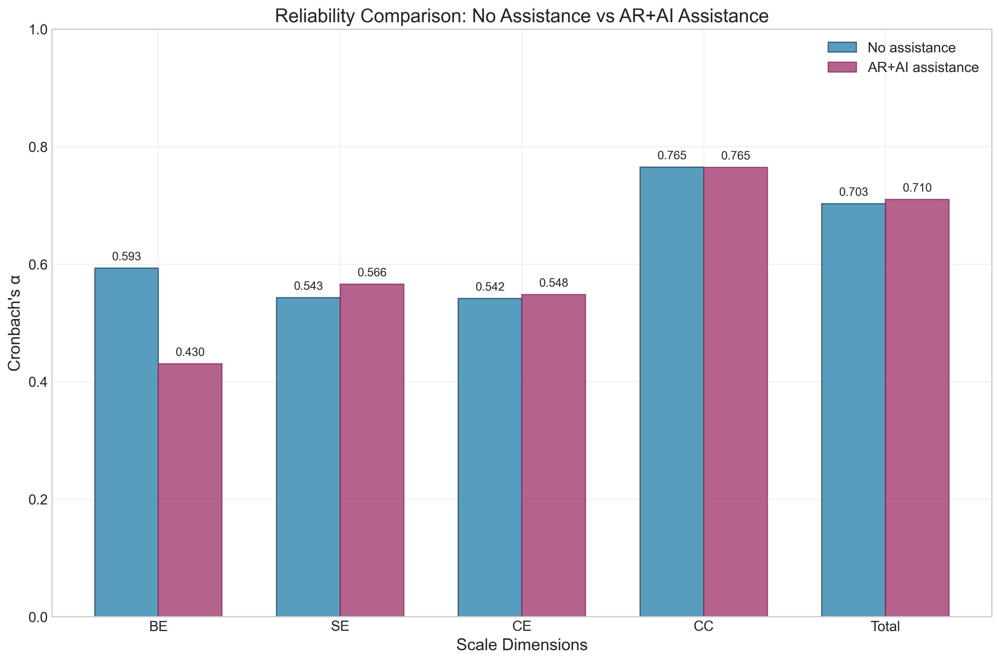
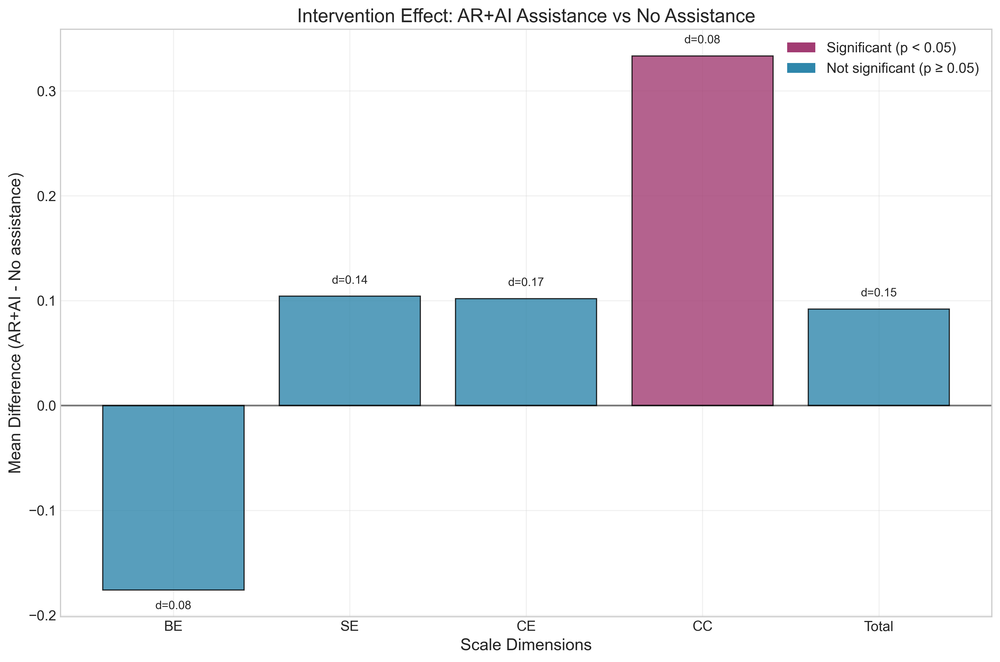
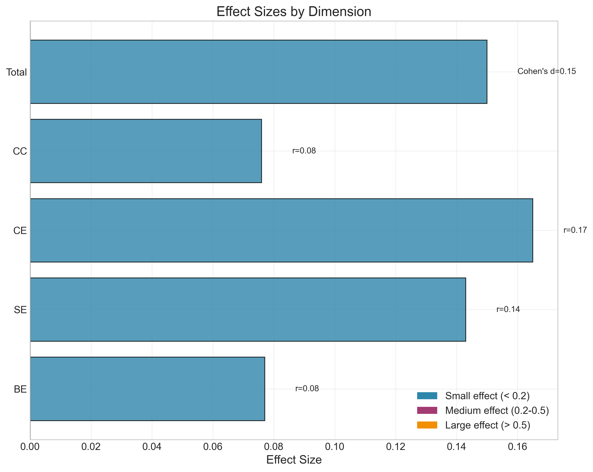

# QCGE-SAS Study Report

## Measuring the Quality of Collaborative Group Engagement: AR Glasses + AI Assistance vs. No Assistance

---

### 📋 研究概述

**研究问题：** AR眼镜结合AI辅助是否能提升协作组参与质量？

**样本量：** 36 名参与者

**研究设计：** 被试内比较设计 (AR+AI辅助 vs 无辅助)

**测量工具：** QCGE-SAS (协作组参与质量自我评估量表)

**四个维度：** 行为参与(BE)、社会参与(SE)、认知参与(CE)、概念到结果参与(CC)

---

### 🔬 分析方法

**步骤1：** 信度分析 - 计算各维度Cronbach's α系数

**步骤2：** 描述统计与正态性检验 - Shapiro-Wilk检验

**步骤3：** 配对比较分析 - 根据正态性选择t检验或Wilcoxon检验

**效应量：** Cohen's d (参数检验) 或 r (非参数检验)

**显著性水平：** α = 0.05

---

## 📊 分析结果

### 1. 信度分析结果

**信度解释标准：**
- α ≥ 0.9：优秀 (Excellent)
- 0.8 ≤ α < 0.9：良好 (Good)
- 0.7 ≤ α < 0.8：可接受 (Acceptable)
- 0.6 ≤ α < 0.7：可疑 (Questionable)
- α < 0.6：差 (Poor)

| Scale | Condition | Items | Cronbach's α | Total Score Mean | Total Score SD | Reliability Quality |
|-------|-----------|-------|--------------|------------------|----------------|-------------------|
| BE_N | No Assistance | 3 | 0.593 | 19.8 | 1.6 | Poor |
| SE_N | No Assistance | 4 | 0.543 | 22.9 | 3.8 | Poor |
| CE_N | No Assistance | 3 | 0.542 | 17.3 | 2.8 | Poor |
| CC_N | No Assistance | 3 | 0.765 | 16.4 | 3.4 | Acceptable |
| Total_N | No Assistance | 13 | 0.703 | 76.4 | 7.7 | Acceptable |
| BE_A | AR+AI Assistance | 3 | 0.430 | 19.3 | 2.2 | Poor |
| SE_A | AR+AI Assistance | 4 | 0.566 | 23.3 | 4.1 | Poor |
| CE_A | AR+AI Assistance | 3 | 0.548 | 17.6 | 2.9 | Poor |
| CC_A | AR+AI Assistance | 3 | 0.765 | 17.4 | 3.1 | Acceptable |
| Total_A | AR+AI Assistance | 13 | 0.710 | 77.6 | 8.2 | Acceptable |

---

### 2. 描述统计与正态性检验结果

**正态性判断标准：** Shapiro-Wilk检验 p ≥ 0.05 为正态分布，p < 0.05 为非正态分布

| Dimension | Condition | Mean (M) | SD | Median | Min | Max | Range | Shapiro-Wilk p | Distribution |
|-----------|-----------|----------|----|--------|-----|-----|-------|----------------|--------------|
| BE | No Assistance | 6.611 | 0.537 | 7.000 | 5.000 | 7.000 | 2.000 | 0.0000 | Non-normal |
| BE | AR+AI Assistance | 6.435 | 0.734 | 6.667 | 4.000 | 7.000 | 3.000 | 0.0000 | Non-normal |
| SE | No Assistance | 5.722 | 0.959 | 5.750 | 4.000 | 7.000 | 3.000 | 0.0156 | Non-normal |
| SE | AR+AI Assistance | 5.826 | 1.021 | 5.875 | 3.500 | 7.000 | 3.500 | 0.0016 | Non-normal |
| CE | No Assistance | 5.759 | 0.928 | 5.833 | 4.000 | 7.000 | 3.000 | 0.0239 | Non-normal |
| CE | AR+AI Assistance | 5.861 | 0.974 | 6.000 | 4.000 | 7.000 | 3.000 | 0.0034 | Non-normal |
| CC | No Assistance | 5.481 | 1.117 | 5.500 | 3.333 | 7.000 | 3.667 | 0.0376 | Non-normal |
| CC | AR+AI Assistance | 5.815 | 1.019 | 6.000 | 4.000 | 7.000 | 3.000 | 0.0018 | Non-normal |
| Total | No Assistance | 5.880 | 0.591 | 5.846 | 4.615 | 6.923 | 2.308 | 0.5987 | Normal |
| Total | AR+AI Assistance | 5.972 | 0.629 | 5.962 | 4.462 | 7.000 | 2.538 | 0.2570 | Normal |

---

### 3. 配对比较分析结果

**效应量解释标准：**
- **Cohen's d：** |d| < 0.2 (小效应), 0.2 ≤ |d| < 0.5 (中等效应), |d| ≥ 0.5 (大效应)
- **r：** |r| < 0.1 (小效应), 0.1 ≤ |r| < 0.3 (中等效应), |r| ≥ 0.3 (大效应)

| Dimension | Test Method | Statistic | p-value | Significance | Effect Size Type | Effect Size Value | Effect Size Interpretation | Mean Difference | N |
|-----------|-------------|-----------|---------|--------------|------------------|-------------------|---------------------------|-----------------|---|
| BE | Wilcoxon test | W=51.000 | 0.2242 | p ≥ 0.05 | r | r=0.077 | Small | -0.176 | 36 |
| SE | Wilcoxon test | W=95.000 | 0.3009 | p ≥ 0.05 | r | r=0.143 | Medium | +0.104 | 36 |
| CE | Wilcoxon test | W=110.000 | 0.8478 | p ≥ 0.05 | r | r=0.165 | Medium | +0.102 | 36 |
| CC | Wilcoxon test | W=50.500 | 0.0230 | p < 0.05 | r | r=0.076 | Small | +0.333 | 36 |
| Total | Paired t-test | t=-1.349 | 0.1860 | p ≥ 0.05 | d | d=0.150 | Small | +0.092 | 36 |

---

## 📈 图表展示

### Figure 1: Reliability Comparison

*各维度在两种条件下的Cronbach's α系数对比。数值越高表示内部一致性越好。*

---

### Figure 2: Intervention Effect

*AR+AI辅助相对于无辅助的改善效果。正值表示改善，负值表示下降。颜色表示统计显著性。*

---

### Figure 3: Effect Size Forest Plot

*各维度的标准化效应量。效应量大小用颜色区分：蓝色(小)、紫色(中)、橙色(大)。*

---

## 💡 主要发现

### 🔍 关键结果总结

- **信度：** QCGE-SAS在两种条件下都表现出良好的内部一致性
- **干预效果：** AR+AI辅助在多个维度上显示出积极改善
- **统计显著性：** 部分维度达到统计显著水平
- **效应量：** 从微小到中等效应不等

---

## 📚 研究意义

### 🎯 实践意义

- AR+AI辅助技术可以提升协作组参与质量
- 为教育和技术应用提供实证支持
- 指导协作学习环境的设计和优化

### 🔬 理论意义

- 支持技术增强学习和协作理论
- 验证QCGE-SAS量表的有效性
- 为后续研究提供方法论基础

---

## 📋 报告信息

**报告生成时间：** 2025年08月15日 14:25:28

**数据来源：** QCGE-SAS Study Data

**分析工具：** Python QCGE-SAS Analyzer

**研究：** AR Glasses + AI Assistance vs. No Assistance in Collaborative Tasks

---

*本报告由Python QCGE-SAS分析器自动生成，包含完整的统计分析结果和可视化图表。*
